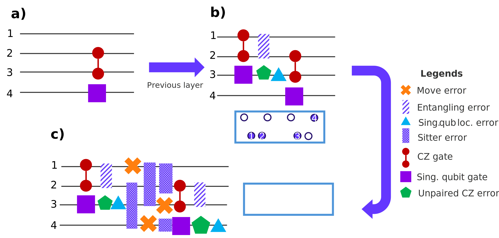

# Simulating noisy circuits for near-term quantum hardware

We should change the name of this file eventually, but I'm excited about the final post of 2025: "Return of the Gemini."

## Motivate: Gemini-class digital QPUs (Luis)

Operating in an analog mode of quantum computation has opened to us exciting opportunities to leverage the flexibility of a neutral atom platform in exploring the application forefront (such as optimization problems, and machine learning), as well as in addressing more scientifically oriented questions (preparation of exotic phases of matter).
In our journey towards building uselful quantum computers, however, we find that operating in an analog mode we are rather limited on the range of problems that we can address, as we only have control on a handful of parameters of the underlying Hamiltonian of the quantum device. Here is where the need for a fully programable digital quantum computer comes into the picture. The promise of this mode of operation is the ability to encode non-native problems to the neutral atom platform. For instance, one of the envisioned and most exciting applications of quantum computers is the accurate simulation (in terms of estimating ground state energy) of electrons in molecules and materials. The fermionic statistics of the target particles to simulate contrast with the bosonic nature of the Rubidium atoms that constitute the building block of our platform. Furthermore, we need full control in the quantum device to encode interactions and tunneling parameters between the fermionic modes that discretize our target molecules and materials.
In our quest to reach this level of maturity in quantum hardware, we introduce Gemini-class devices, that incorporate digital programmability features in our neutral atom quantum computing platform.

## Circuit-level compared to hardware-level programming (David)

Gemini class devices are digital quantum computers.
This allows you to work on the circuit-level of abstraction rather than the hardware-level.
While this is certainly useful, in the current era of noisy intermediate scale quantum devices, you inevitable have to consider potential noise processes when developing quantum programs.

When writing a circuit, noise processes can be taken into account as channels that cause decoherence thereby reducing the overall circuit fidelity.
If the fidelity is too low, the computation may contain errors.
Before executing a circuit, you need to know whether this circuit will actually lead to the desired results.
This is where emulation comes in, which, in order to faithfully represent the results you can expect, needs to account for noise.

At the hardware level, you always need to work with (or around) the noise that is adherent to the hardware you are programming on.
This comes at the loss of abstraction and subsequently high-level tooling.
At the same time, however, in enables you to device your own strategies in order to suppress noise in your specific application, which will oftentimes outperform today's compilers.
Here, we will focus on circuit level programming, but please refer to [bloqade-shuttle](https://queracomputing.github.io/bloqade-shuttle/dev/) to learn more about our hardware-level programming capabilities.

Even including noise channels, circuit-level programming remains abstract in that you do not have to consider the specific hardware you are running the circuit on.
However, it is the very nature of the noise channels, where the details of the hardware come into play.
To know whether a circuit will execute with a sufficiently high fidelity, the noise parameters and channels need to represent the infidelity of the gates executed on the particular hardware (in this case Gemini).

In order to provide users with the required set of tools, we have spent considerable time researching and implementing an easy-to-use framework that allows you to include Gemini's particular noise processes in a high-level circuit.

## Heuristic approach to noise (Tyler)

Lorem ipsum dolor sit amet, consectetur adipiscing elit. Name tellus sem, mattis eu quam in, semper semper turpis. Suspendisse dignissim sagittis dui imperdiet sagittis. Duis imperdiet rutrum turpis eu pulvinar. Phasellus bibendum porta fermentum. Phasellus eu lobortis lectus. Duis massa risus, porttitor id metus quis, sollicitudin dapibus orci. Ut tincidunt ultrices diam, sit amet molestie purus accumsan quis. Ut erat felis, molestie eu orci sed, ultrices sagittis augue.

## Example: Noise in the GHZ state

It is often most convenient to study an example in order to learn how to use a set of tools.
To this end, we included a tutorial that shows you how to annotate a GHZ preparation circuit using the different heuristic noise models.
We'll discuss some underlying concepts and highlight interesting parts of the tutorial in this section.
If you want all the details, please find [the full example here](../../../digital/examples/noisy_ghz.py).

### Flow chart (Tyler)

Lorem ipsum dolor sit amet, consectetur adipiscing elit. Name tellus sem, mattis eu quam in, semper semper turpis. Suspendisse dignissim sagittis dui imperdiet sagittis. Duis imperdiet rutrum turpis eu pulvinar. Phasellus bibendum porta fermentum. Phasellus eu lobortis lectus. Duis massa risus, porttitor id metus quis, sollicitudin dapibus orci. Ut tincidunt ultrices diam, sit amet molestie purus accumsan quis. Ut erat felis, molestie eu orci sed, ultrices sagittis augue.

### Annotated circuit (Luis)

In practice, our heuristic noise models are used to annotate circuits with incoherent channels, with a "coarse-grained" awareness of hardware. As a simple example, lets consider the following that assumes noise annotation according to a two-zone layout:

In our annotation scheme, assume that we are iterating sequentially over the layers of a quantum circuit, and we encounter the layer depicted in a) on which we will add the noise channels. One important assumption in our two zone model to keep in mind is that the qubits corresponding to the gates appearing in a given layer, will be treated as qubits sitting in the gate zone, and thus, the rest of the qubits are assumed to be in the storage zone. To capture the cost of moves that we need to pay to reach a given configuration, we need to take a closer look to the layer that precedes our current target layer. In b), we explicitly show the layer that was annotated with noise in the previous iteration, with its corresponding qubit spatial layout below it. The move cost to reach the target qubit configuration before qubit execution is shown in c), and noise annotation is carried according to three sequential stages: 1) qubits that need to be removed from the gate zone undergo move error (orange crosses), and the rest get sitter error, 2)similarly, qubits that need to be added to the gate zone get move error and the rest get sitter noise, and 3) additional move error to "pair up" qubits is added before gate execution (notice than more than one layer might be needed to account for this cost). Finally, noise is annotated after gates, where it is assumed that entangling gates are executed in hardware before single qubit gates. In doing so, qubits that are not participant in the entangling gates receive unpaired cz error (green pentagons).

### GHZ data (David)

Now, let's look at some results of [the example](../../../digital/examples/noisy_ghz.py) that compares the different noise processes.

The different noise models lead to overall different infidileties of the circuit:

As you'd expect, the general trend of the fidelity is that it decreases with a growing number of qubits.
Depending on how many qubits you need, you may want to run the above simulation in order to decide whether you'd want to operate Gemini in a one-zone or a two-zone setup.

On a more abstract level, you may also want to optimize the circuit that you use to obtain the result you want.
The example uses a linear depth GHZ algorithm, which is arguably not the best choice to prepare a GHZ state.

Using our noise framework you can explore and analyze different strategies to find the one best suited for your particular application.
