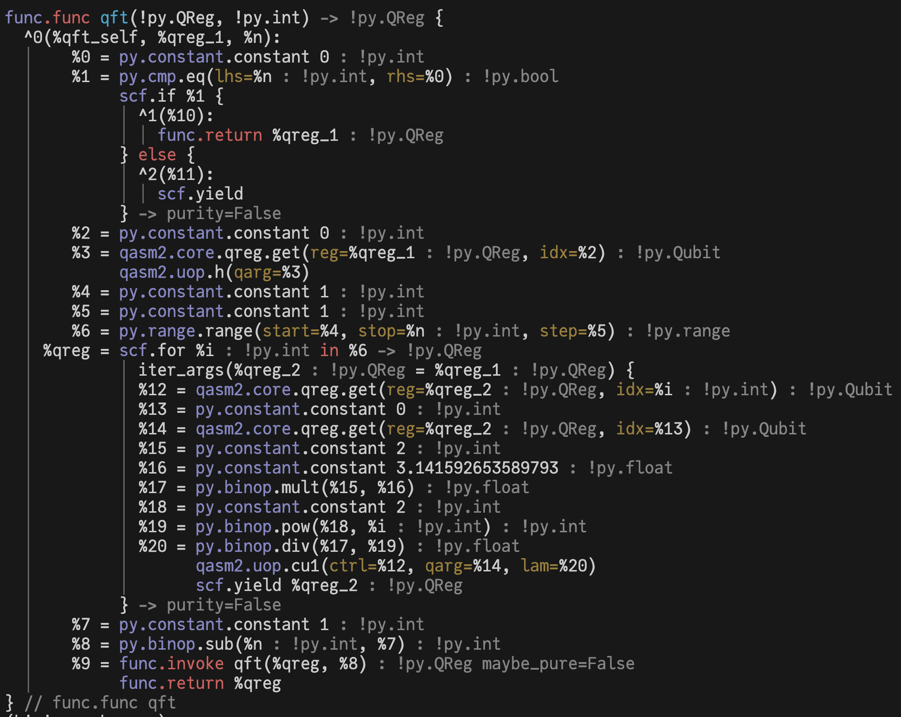
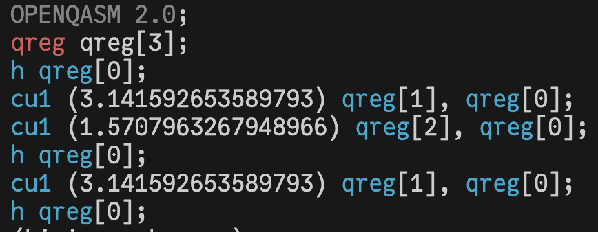

# QASM2

## Open Quantum Assembly Language (QASM2) and beyond

We have chosen to closely mirror the semantics of the Open Quantum Assembly Language (QASM2) in bloqade-circuits. The QASM2 dialect is a simple quantum assembly language that allows you to write quantum circuits in a human-readable format. However, one should note that QASM2 is a very restricted language and does not support all the features of a high-level language.

For example, there is a separation of **gate routines** declared with `gate` and main program written as a sequence of gate applications. While the gate routine is similar to a function in many ways, it does not support high-level features such as recursion (due to lack of `if` statement support inside) or control flows.

Indeed, bloqade-circuits is designed with the notion of [kernels](https://queracomputing.github.io/kirin/latest/blog/2025/02/28/introducing-kirin-a-new-open-source-software-development-tool-for-fault-tolerant-quantum-computing/?h=kernel#what-are-kernel-functions) in mind by decorating functions with a `@qasm2.extended` decorator. The python code is interpreted and parsed by the [Kirin](https://queracomputing.github.io/kirin/latest/) compiler toolchain and lowered to an abstract representation of the program. These kernels can include classical computation and the usual programming structures-- if/else, for and while loops, function inputs, and the like, as one is used to in Python.

Additionally, the QASM2 representations of bloqade-circuits have been extended to include a key advantage of reconfigurable neutral atom hardware: parallelism. For example, one can represent a CZ gate applied to many qubit pairs at once as

```python
from bloqade import qasm2
from kirin.dialects import ilist
from typing import Any

@qasm2.extended
def parallel_cz(controls: ilist.IList[qasm2.Qubit, Any], targets: ilist.IList[qasm2.Qubit, Any]):
    for ctr in range(len(controls)):
        qasm2.cz(ctrl=controls[0],qarg=targets[1])
```

or equivalently use a SIMD (single instruction multiple data)-like instruction to explicitly flag the parallelism

```python
@qasm2.extended
def simd_cz(controls: ilist.IList[qasm2.Qubit, Any], targets: ilist.IList[qasm2.Qubit, Any]):
    qasm2.parallel.cz(ctrls=controls,qargs=targets)
```

Both will ultimately emit the exact same QASM code, but the latter snippet represents the kind of parallelism that can be leveraged by reconfigurable neutral atom hardware to more efficiently execute a program.

## Quick Example

You can program kernels and quantum programs using the `qasm2.extended` decorator, such as the following Quantum Fourier Transform (QFT) circuit:

```python
import math
from bloqade import qasm2

@qasm2.extended
def qft(qreg: qasm2.QReg, n: int, k: int):
    if k == n:
        return qreg

    qasm2.h(qreg[k])
    for i in range(k + 1, n):
        qasm2.cu1(qreg[i], qreg[k], math.pi / 2**i)
    qft(qreg, n, k + 1)  # recursion
    return qreg

qft.print()
```

While the syntax is similar to Python, the `qasm2.extended` decorator actually compiles the `qft` function
into lower-level intermediate representation (IR) code that can be later interpreted, analyzed, or executed on quantum hardware. Observe that this function cannot immediately compile down to QASM as it takes parametrized inputs, and is called recursively.

You can inspect the initial IR code by calling the pretty printer:

```python
qft.print()
```



We can also emit QASM2 code from it.
Note, that native QASM2 does not support arguments or return values.
Therefore, we wrap the `qft` kernel from above in another one, that simply invokes `qft` for a specific set of arguments.
Then, we emit this new kernel as a QASM2 program.

```python
from bloqade.qasm2.emit import QASM2 # the QASM2 target
from bloqade.qasm2.parse import pprint # the QASM2 pretty printer

# NOTE: we wrap the qft kernel calling it with a set of arguments
@qasm2.extended
def main():
    n = 3
    q = qasm2.qreg(n)
    qft(q, n, 0)

target = QASM2()
ast = target.emit(main)
pprint(ast)
```


