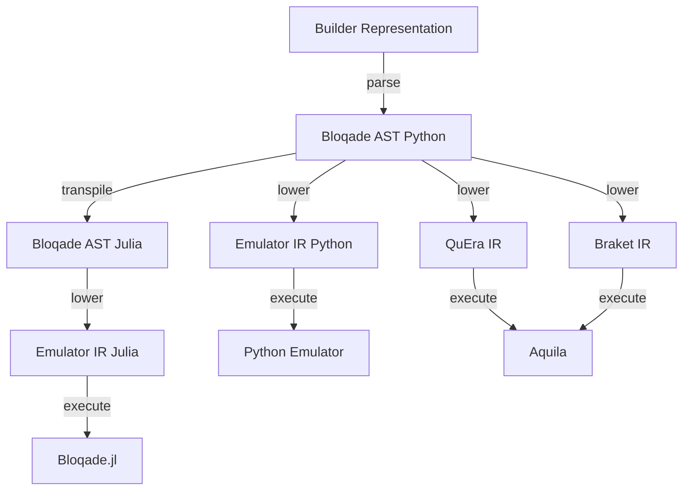

Thank you for your interest in contributing to the project! We welcome all contributions. There are many different ways to contribute to Bloqade, and we are always looking for more help. We accept contributions in the form of bug reports, feature requests, documentation improvements, and code contributions. For more information about how to contribute, please read the following sections.

* [Reporting a Bug](#reporting-a-bug)
* [Reporting a Documentation Issue](#reporting-a-documentation-issue)
* [Requesting new Features](#requesting-new-features)
* [Developing Bloqade](/guides/contributing/)
* [Design Philosophy and Architecture](#design-philosophy-and-architecture)
* [Community Slack](#community-slack)
* [Ask a Question](#ask-a-question)
* [Providing Feedback](#providing-feedback)

## Reporting a Bug

Bloqade is currently in the **alpha** phase of development, meaning bugs most likely exist in the
current implementation. We are continuously striving to
improve the stability of Bloqade. As such, we encourage
our users to report all bugs they find. To do this, we
ask you to submit an issue to our GitHub page:
[https://github.com/QuEraComputing/bloqade-analog/issues](https://github.com/QuEraComputing/bloqade-analog/issues)

Please include the following information in your bug report:

1. A short, descriptive title.
2. A detailed description of the bug, including the expected behavior and what happened.
3. A minimal code example that reproduces the bug.
4. The version of Bloqade you are using.
5. The version of Python you are using.
6. The version of your operating system.

## Reporting a Documentation Issue

We are always looking to improve our documentation. If you find
a typo or think something is unclear, please open an issue on
our GitHub page: [https://github.com/QuEraComputing/bloqade-analog/issues](https://github.com/QuEraComputing/bloqade-analog/issues)

For typos or other minor problems, create an issue that contains
a link to the specific page that includes the problem, along with
a description of the problem and possibly a solution.

For a request for new documentation content, please open up an
issue and describe what you think is missing from the documentation.

## Requesting new Features

Given that we are currently at the beginning of the development of
the Bloqade python interface, we are open to suggestions about what
features would be helpful to include in future package iterations.
If you have a request for a new feature, please open an issue on our
GitHub page: [https://github.com/QuEraComputing/bloqade-analog/issues](https://github.com/QuEraComputing/bloqade-analog/issues)

We ask that the feature requests be as specific as possible. Please
include the following information in your feature request:

1. A short, descriptive title.
2. A detailed description of the feature, including your attempt to solve the problem with the current version of Bloqade.
3. A minimal code example that demonstrates the need for the feature.
4. The version of Bloqade you are using.
5. The version of Python you are using.
6. The version of your operating system.

## Design Philosophy and Architecture

Given the heterogeneous nature of the hardware we target,
we have decided to use a compiler-based approach to our software
stack, allowing us to target different hardware backends
with the same high-level language. Below is a diagram of the
software stack in Bloqade.

### High-Level Builder Representation

When programming Bloqade using the Python API, the user constructs
a representation of an analog quantum circuit. This representation
is a *flattened* version of the actual analog circuit. *Flattened*
means that the user input is a linear sequence of operations where
the context of neighboring nodes in the sequence of instructions
can determine the program tree structure. The Bloqade AST describes
the actual analog circuit.

### Bloqade AST

The Bloqade AST is a representation of a quantum analog circuit for
neutral atom computing. It is a directed acyclic graph (DAG) with nodes
for different hierarchical levels of the circuit. The base node is the
`AnalogCircuit` which contains the geometry of the atoms stored as a
`AtomArragment` or `ParallelRegister` objects. The other part of the
circuit is the `Sequence`, which contains the waveforms that describe
the drives for the Ryberg/Hyperfine transitions of
each Rydberg atom. Each transition is represented by a `Pulse` including
a `Field` for the drive's detuning, Rabi amplitude, and Rabi phase.
A `Field` relates the spatial and temporal dependence
of a drive. The spatial modulates the temporal dependence of the
waveform. A DAG also describes the `Waveform` object. Finally, we
have basic `Scalar` expressions as well for describing the syntax
of real-valued continuous numbers.

### Bloqade Compilers and Transpilers

Given a user program expressed as the Bloqade AST, we can target various
backends by transforming from the Bloqade AST to other kinds of IR.
For example, when submitting a task to QuEra's hardware, we transform the
Bloqade AST to the IR that describes a valid program for the hardware.

This process is referred to as `lowering`, which in a general sense is a
transformation that takes you from one IR to another where the target IR
is specialized or has a smaller syntactical structure. `Transpiling`
corresponds to a transformation that takes you from
one language to equivalent expressions in another. For example, we
can transpile from the Bloqade AST in Python to the Bloqade AST in Julia.
The generic term for both of these types of transformation in Bloqade is
Code Generation. You will find various code generation implementations
in various `codegen` modules.

## Community Slack

You can join QuEra's Slack workspace with this [link](https://join.slack.com/t/querapublic/shared_invite/zt-1d5jjy2kl-_BxvXJQ4_xs6ZoUclQOTJg). Join the `#bloqade` channel to discuss anything related to Bloqade.

## Ask a Question

If you're interested in contributing to Bloqade, or just want to discuss the project, join the discussion on GitHub Discussions at [https://github.com/QuEraComputing/bloqade-analog/discussions](https://github.com/QuEraComputing/bloqade-analog/discussions)

## Providing Feedback

While GitHub Issues are a great way for us to better understand any issues you're having with Bloqade as well as provide us with feature requests, we're always looking for ways to collect more general feedback about what the user experience with Bloqade is like.

To do that we have [this form](https://share.hsforms.com/1FJjYan2VQC6NfrQ5IPAcewdrwvd) where you can provide your thoughts after using/experimenting/tinkering/hacking with Bloqade.

Your feedback will help guide the future of Bloqade's design so be honest and know that you're contributing to the future of Quantum Computing with Neutral Atoms!
