The flow chart below gives a high-level overview of the different steps and components in the
builder syntax, from defining a program with `start` all the way through to execution. Each node
links to the relevant part of the [API reference](/api/latest/python).

## Build Workflow

```mermaid
flowchart TD
  ProgramStart(["start"])

  Geometry("Geometry or Lattice")

  Coupling["Coupling
  -----------
  rydberg
  hyperfine"]

  Detuning["detuning"]
  Rabi["rabi"]

  Amplitude["amplitude"]
  Phase["phase"]

  SpaceModulation("SpatialModulation
  ----------------------
  uniform
  scale
  location
  ")
  Waveform{"Waveform
  ------------
  piecewise_linear
  piecewise_constant
  constant
  linear
  poly
  fn
  "}

  Options(["Options
  ---------
  assign
  batch_assign
  args
  parallelize
  "])

  Services(["Services
  ----------
  bloqade
  quera
  braket"])

  QuEraBackends(["Backends
  ------------
  mock
  cloud_mock
  aquila
  device"])

  BraketBackends(["Backends
  ------------
  aquila
  local_emulator"])

  BloqadeBackends(["Backends
  ------------
  python
  julia"])

  Execution("
  Execution hardware only
  -------------------------------
  run_async()

  Hardware and simulation
  -------------------------------
  run()
  __call__")

  ProgramStart -->|add_position| Geometry;
  Geometry --> Coupling;
  ProgramStart --> Coupling;

  Coupling --> Detuning;
  Coupling --> Rabi;

  Rabi --> Amplitude;
  Rabi --> Phase;

  Detuning --> SpaceModulation;
  Amplitude --> SpaceModulation;
  Phase --> SpaceModulation;

  SpaceModulation --> Waveform;

  Waveform --> Coupling;
  Waveform --> Services;
  Waveform --> Options;
  Options --> Services;

  Services -->|quera| QuEraBackends;
  Services -->|braket| BraketBackends;
  Services -->|bloqade| BloqadeBackends;
  QuEraBackends --> Execution;
  BraketBackends --> Execution;
  BloqadeBackends --> Execution;

  click ProgramStart "/api/latest/python/bloqade/analog/builder/start/";
  click Geometry "/api/latest/python/bloqade/analog/atom_arrangement/";
  click Coupling "/api/latest/python/bloqade/analog/builder/drive/";
  click Detuning "/api/latest/python/bloqade/analog/builder/field/";
  click Rabi "/api/latest/python/bloqade/analog/builder/field/";
  click Amplitude "/api/latest/python/bloqade/analog/builder/field/";
  click Phase "/api/latest/python/bloqade/analog/builder/field/";
  click SpaceModulation "/api/latest/python/bloqade/analog/builder/spatial/";
  click Waveform "/api/latest/python/bloqade/analog/builder/waveform/";
  click Options "/api/latest/python/bloqade/analog/builder/pragmas/";
  click Services "/api/latest/python/bloqade/analog/builder/backend/";
  click QuEraBackends "/api/latest/python/bloqade/analog/builder/backend/quera/";
  click BraketBackends "/api/latest/python/bloqade/analog/builder/backend/braket/";
  click BloqadeBackends "/api/latest/python/bloqade/analog/builder/backend/bloqade/";
  click Execution "/api/latest/python/bloqade/analog/ir/routine/braket/";
```

