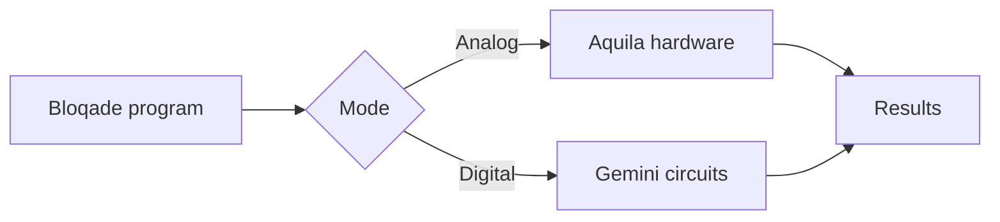

This throwaway guide page exists to prove the math pipeline
(`remark-math` + `rehype-katex` + KaTeX CSS) renders correctly in the build.

## Inline math

Euler's identity is $e^{i\pi}+1=0$, rendered inline via KaTeX.

## Display math

The Rydberg Hamiltonian used across Bloqade Analog:

$$
\hat{H} = \sum_{i} \frac{\Omega_i}{2}\,\sigma^x_i
        - \sum_{i} \Delta_i\,\hat{n}_i
        + \sum_{i<j} V_{ij}\,\hat{n}_i \hat{n}_j
$$

## Mermaid diagram

This ` ```mermaid ` fenced block is rendered client-side (see
`src/components/MermaidHead.astro`) and follows the light/dark theme:


